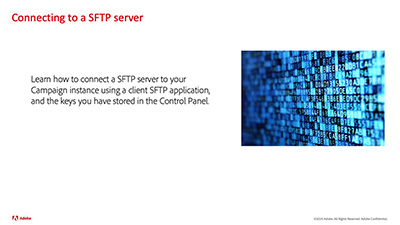

# Campaign 컨트롤 패널 - 개요

Campaign 컨트롤 패널을 통해 Adobe Campaign 관리자는 주요 에셋을 모니터링하고 개별 또는 허용 목록 IP 주소별 SFTP 스토리지 관리와 같은 관리 작업을 수행할 수 있습니다.

## 직원 추천

<table>
<tr>
<td>
    
    

      <a href="./get-started.md">
    <strong>Campaign 컨트롤 패널 시작</strong>
    </a>
    

    

    <em>Campaign 컨트롤 패널에 액세스하는 방법과 컨트롤 패널에서 사용할 수 있는 사전 요구 사항을 알아봅니다. </em>
    

  </td>
  <td>
    
    

      <a href="./instance-settings/gpg-key-management/generate-and-install-gpg-keys.md">
    <strong>데이터 암호화에 대한 GPG 키 생성 및 설치</strong>
    </a>
    

    

    <em>Campaign 컨트롤 패널에 저장한 키를 사용하여 클라이언트 SFTP 애플리케이션을 통해 SFTP 서버에 연결하는 방법을 알아봅니다. </em>
    

  </td>
  <td>
    
    

      <a href="./sftp-management/connect-to-sftp-server.md">
    <strong>SFTP 서버에 연결</strong>
    </a>
    

    

    <em>Campaign 컨트롤 패널에 저장한 키를 사용하여 클라이언트 SFTP 애플리케이션을 통해 SFTP 서버에 연결하는 방법을 알아봅니다. </em>
    

  </td>
</tr>
</table>

## 추가 리소스

* [Campaign 컨트롤 패널 도움말 센터](https://experienceleague.adobe.com/docs/control-panel/using/control-panel-home.html?lang=ko)
