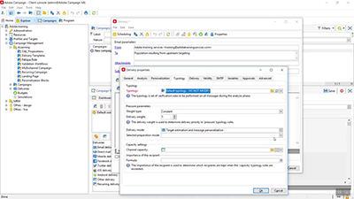

# Adobe Campaign v8 클라이언트 콘솔 튜토리얼

Adobe Campaign은 크로스채널 고객 경험을 디자인할 수 있는 플랫폼을 제공하며 시각적 캠페인 오케스트레이션, 실시간 상호 작용 관리 및 크로스채널 실행 환경을 제공합니다. 이 사용 안내서에는 Adobe Campaign V8 클라이언트 콘솔의 다양한 기능과 성능에 대한 비디오 및 튜토리얼이 포함되어 있습니다.

보기

>[!INFO]
> 질문이 있습니까? 경험을 공유하거나 동료와 의견을 교환하시겠습니까? 또는 Adobe 팀을 위한 학습 컨텐츠에 대한 피드백을 가지고 있습니까? [Adobe Campaign 학습 커뮤니티 스레드](https://experienceleaguecommunities.adobe.com:443/t5/adobe-campaign-classic/join-the-discussion-on-adobe-campaign-learning/td-p/419096)에서 대화에 참여하십시오.
> 
> 이 튜토리얼은 원하던 답변이 아닌가요?
> Campaign Web 사용자 인터페이스를 사용하는 방법에 대한 안내는 [Adobe Campaign Web 사용자 인터페이스 튜토리얼](https://experienceleague.adobe.com/docs/campaign-web-learn/tutorials/overview.html?lang=ko)을 참조하십시오.

>[!NOTE]
> Campaign v8은 현재 관리 Cloud Service로만 사용할 수 있으며 온-프레미스 또는 하이브리드 환경에 배포할 수 없습니다. 기존 Campaign Classic v7 환경에서의 자동 마이그레이션은 아직 불가능합니다.
>
>Classic v7에서 V8로 전환하는 방법에 대한 자세한 내용은 [제품 설명서](https://experienceleague.adobe.com/docs/campaign/campaign-v8/new/v7-to-v8.html?lang=ko)를 참조하십시오.

## 직원 추천

<table>
<tr>
  <td>
    
    

      <a href="/help/get-started/create-a-marketing-plan-programs-and-campaigns.md">
    <strong>마케팅 계획 만들기</strong>
    </a>
    

    

    <em>마케팅 계획, 프로그램, 캠페인 만드는 방법을 알아봅니다.</em>
    

  </td>
   <td>
    
    

      <a href="./content-creation/create-and-design-email-deliveries.md">
    <strong>이메일 게재 만들기 및 디자인</strong>
    </a>
    

    

    <em>이메일 게재 만들기 프로세스를 이해하고, 이메일 콘텐츠를 디자인하고 개인화하는 방법을 알아봅니다.
</em>
    

  </td>
  <td>
    
    

      <a href="./send-messages/fatigue-management/typology-rules-for-fatigue-management.md">
    <strong>유형화 규칙을 사용한 피로도 관리</strong>
    </a>
    

    

    <em>Adobe Campaign에서 유형화 규칙을 사용하여 피로도 관리를 구현하는 방법을 알아봅니다. </em>
    

  </td>
</tr>
<tr>
</td>
  <td>
    
    

      <a href="./reporting/generate-a-descriptive-analysis-report.md">
    <strong>기술 분석 보고서 생성</strong>
    </a>
    

    

    <em>워크플로에서 설명 분석 보고서를 생성하는 방법을 알아봅니다.</em>
    

  </td>
  <td>
   
     

      <a href="./data-management/data-management-fundamentals.md">
    <strong>워크플로를 통한 데이터 관리의 기본 사항</strong>
    </a>
    

    

    <em>타겟팅 차원과 작업 테이블이 무엇인지와 Adobe Campaign에서 다양한 데이터 소스에 흩어진 데이터를 관리하는 방법을 알아봅니다.</em>
    

  </td>
  <td>
   
     

      <a href="./data-management/api-staging-mechanism.md">
    <strong>FFDA를 사용한 API 스테이징 메커니즘</strong>
    </a>
    

    

    <em>Full FDA를 사용한 API 스테이징 메커니즘의 작동 원리를 알아봅니다.</em>
    

  </td>
</tr>
</table>

